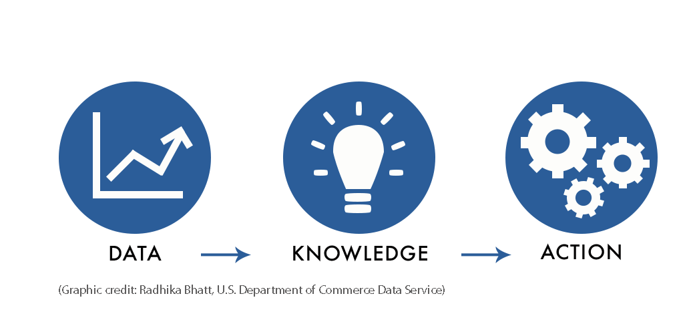

## 4 Reasons why understanding data is key

In today's digital age, data is everywhere. Being able to understand and analyze data is known as data literacy. In both educational and professional settings, data literacy skills are vital to [success](https://www.precisely.com/blog/data-integrity/data-literacy-what-it-is-and-why-it-matters). Data is virtually in every space. We are constantly looking at numbers, text, images, videos, and our personal data is always being collected as we are actively using our phones or computers. Whether we realize it or not, data is always at our fingertips. Increasing our knowledge and personal skill set to collect, store, clean and analyze data allows us to understand how to apply critical thinking skills to everyday problems. Here are four reasons why understanding data is of great value to college students, and people entering the workforce.  

#### 1. Data literacy promotes valued critical thinking skills.

Problem solving is a skill we learn from a very young age. The idea of problem solving when it comes to data is something that people are still learning the importance of. By understanding numbers, and being able to analyze them, you allow yourself to build a skill that you need to understand everyday situations online and in person. You also expand your mindset to explore how computer systems and data collection works. In this, you are essentially understanding how data shapes society, and allows you to use data skills to solve everyday problems. 

#### 2. Data is EVERYWHERE.

Whether you realize it or not, data truly is everywhere. Without data literacy skills in our modern society, students may not be able to progress in the educational or professional workforce. Since data has become such a prominent part of our society in the digital age, data literacy is essential to success.

#### 3. Data literacy is in high demand.

Employers actively look for new hires that have outstanding data literacy skills to help their companies succeed. Data has been a huge part of developing successful brand tactics internally. A large contributor to the success of companies we see today is the fact that they have data literate employees who can translate the numbers to set them up for success. Without data comprehension, and data literacy, there is no way of measuring if what you are doing is successful or not. 

#### 4. Digitalization is moving at a rapid pace.

New apps, computer programs, and technology are created every day. With how fast digitalization is moving, especially during the Covid-19 pandemic, the value of data is constantly increasing. Schools and companies are using algorithms that analyze data in order to better understand how the students' minds or consumers' minds work. Digitalization makes data _accessible_, while data literacy skills help you to better understand the digital world and the way it works. This allows data literate students and people to apply these skills to [real world problems](https://online.jcu.edu.au/blog/data-science-solves-business-problems) and make more informed decisions.

With a rapidly changing world, data has become an enormous factor in everyday life. “In the last 2 years, 90% of the world’s data has been created and businesses are spending more than $180 billion a year on big data analysis”([source](https://www.bornfight.com/blog/7-real-world-examples-of-how-brands-are-using-big-data-analytics/)). In the ways we communicate with companies and online programs, data literacy is essential to understanding how these systems function. Understanding and having the ability to analyze data automatically puts you a step ahead when planning to enter the workforce. Understanding this data further allows you to help uncover essential business opportunities for companies, further increasing customer satisfaction. Along with this, upkeep of communication online is essential for us to understand. Without data literacy skills, we lose touch with the ever so present digital world. Promoting data literacy skills in schools is more important now than ever. With college students being the future of our world, it is important that they understand and promote the ideas and values of data literacy.

----

This contributed blog post was written by students from the [Tehama Group Communications](http://tehamagrouppr.com/). 
